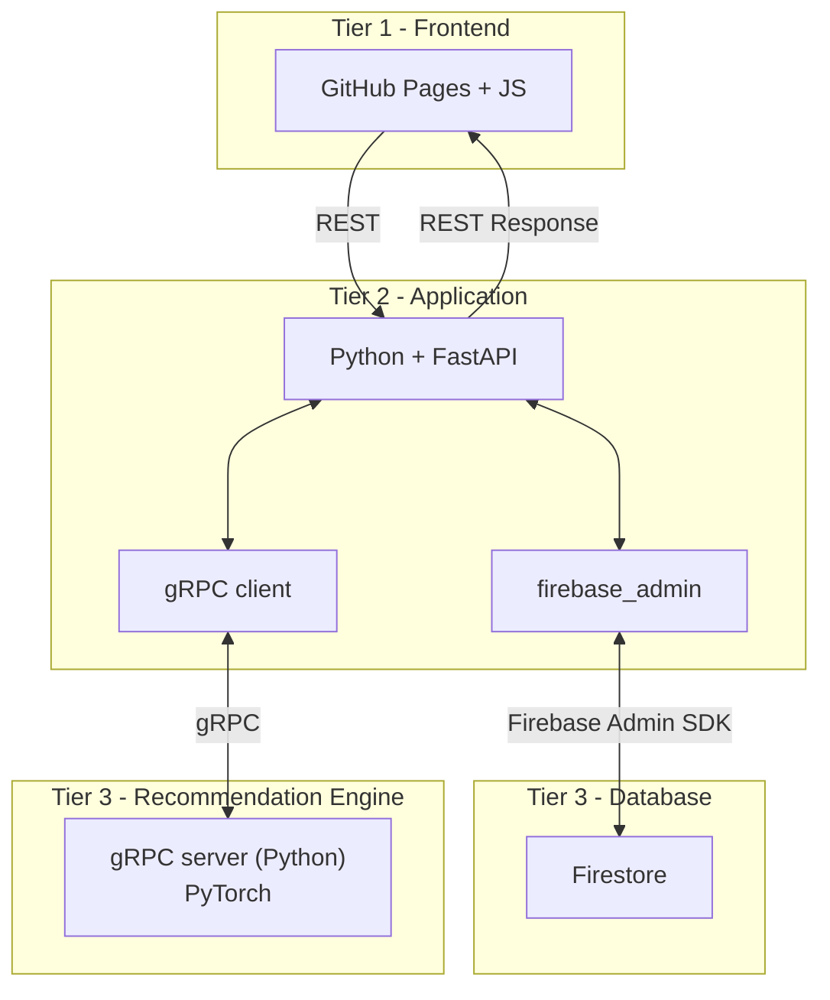

# Link
Coursework for distributed systems and web development lectures, implementing a full-stack social network prototype.

## Deployment & Architecture overview

```mermaid
graph TD
    subgraph Tier 1 - Frontend
        FE["GitHub Pages + JS"]
    end

    subgraph Tier 2 - Application
        API["Python + FastAPI"]
        FBSDK["firebase_admin"]
        GRPC_CLIENT["gRPC client"]
        API <---> FBSDK
        API <---> GRPC_CLIENT
    end

    subgraph Tier 3 - Database
        FS["Firestore"]
    end

    subgraph RecEngine["Tier 3 - Recommendation Engine"]
        REC["gRPC server (Python)\nPyTorch"]
    end

    FE -->|REST| API
    API -->|REST Response| FE
    FBSDK <-->|Firebase Admin SDK| FS
    GRPC_CLIENT <-->|gRPC| REC

```
