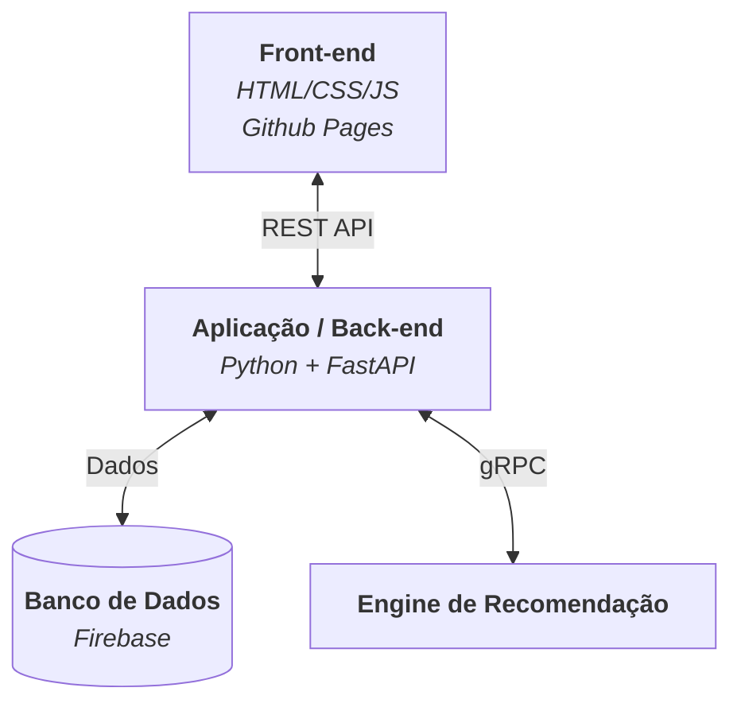

# Link
Uma simples rede social.
Trabalho exclusivamente para fins acadêmicos, feito por Murilo M. Grosso e Octávio X. Fúrio para as disciplinas de Sistemas Distribuídos e Introdução ao Desenvolvimento Web.

## Arquitetura do Sitema


## Front-end

Escrever aqui...

## Back-end

API REST construída com **FastAPI** e hospedada no Render.com em: `https://link-4lqo.onrender.com`

---

### Serviços

| Módulo | Prefixo | Descrição |
|---|---|---|
| `auth.py` | `/auth` | Cadastro e login |
| `users.py` | `/users` | Perfil, follows, cores, bio |
| `posts.py` | `/posts` | Publicações e curtidas |
| `chat.py` | `/chat` | Mensagens entre usuários |
| `rec.py` | `/rec` | Feed e sugestões de usuários |

---

### Auth — `/auth`

#### POST `/auth/signin`
Autentica um usuário existente.

**Body:**
```json
{ "username": "string", "password": "string" }
```

**Resposta:**
```json
{ "user_id": "uuid", "username": "string" }
```

**Erros:** `404` usuário não encontrado · `401` senha incorreta

---

#### POST `/auth/signup`
Cria uma nova conta.

**Body:**
```json
{ "username": "string", "password": "string" }
```

**Resposta:**
```json
{ "user_id": "uuid", "username": "string" }
```

**Erros:** `409` username já em uso

> A senha é armazenada como hash SHA-256 com salt aleatório. Nunca é retornada pela API.

---

### Users — `/users`

#### GET `/users/search/{query}`
Busca usuários cujo username começa com `query`.

**Query params:** `top_k` (padrão: 5, máx: 50)

**Resposta:** lista de objetos de usuário (sem campos sensíveis).

---

#### GET `/users/{user_id}`
Retorna dados públicos de um usuário.

**Resposta:**
```json
{ "user_id": "uuid", "username": "string", "bio": "string", "mink_colors": [0..255 × 9] }
```

---

#### DELETE `/users/{user_id}`
Remove um usuário do sistema.

---

#### GET `/users/{user_id}/colors`
Retorna a paleta de cores do Mink do usuário.

**Resposta:**
```json
{ "mink_colors": [r, g, b, r, g, b, r, g, b] }
```

> Array de 9 inteiros (0–255) representando 3 cores RGB: pelo secundário, pelo principal e fundo/olhos.

---

#### PUT `/users/{user_id}/colors`
Atualiza a paleta de cores do Mink.

**Body:**
```json
{ "colors": [r, g, b, r, g, b, r, g, b] }
```

---

#### GET `/users/{user_id}/bio`
Retorna a bio do usuário.

**Resposta:** `{ "bio": "string" }`

---

#### PUT `/users/{user_id}/bio`
Atualiza a bio (máx. 256 caracteres).

**Body:** `{ "bio": "string" }`

---

#### GET `/users/{user_id}/likes`
Retorna lista de `post_id`s curtidos pelo usuário.

---

#### GET `/users/{user_id}/likes_received`
Soma total de curtidas recebidas em todas as publicações do usuário.

**Resposta:** `{ "likes": number }`

---

#### GET `/users/{user_id}/followings`
Lista os IDs dos usuários que `user_id` segue.

---

#### GET `/users/{user_id}/followers`
Lista os IDs dos seguidores de `user_id`.

---

#### POST `/users/{user_id}/follow`
Segue outro usuário.

**Body:** `{ "user_id": "id_a_seguir" }`

**Erros:** `409` já segue

---

#### DELETE `/users/{user_id}/follow`
Deixa de seguir um usuário.

**Body:** `{ "user_id": "id_a_deixar_de_seguir" }`

**Erros:** `404` não estava seguindo

---

### Posts — `/posts`

#### POST `/posts`
Cria uma publicação (máx. 256 caracteres).

**Body:**
```json
{ "user_id": "uuid", "content": "string", "temp_username": "string" }
```

**Resposta:** `{ "post_id": "uuid" }`

---

#### GET `/posts/{post_id}`
Retorna uma publicação pelo ID.

**Resposta:**
```json
{
  "post_id": "uuid",
  "user_id": "uuid",
  "content": "string",
  "likes_count": 0,
  "created_at": "timestamp"
}
```

---

#### GET `/posts/user/{user_id}`
Lista todas as publicações de um usuário.

---

#### POST `/posts/{post_id}/like`
Curte uma publicação. Incrementa `likes_count` atomicamente.

**Body:** `{ "user_id": "uuid" }`

**Erros:** `409` já curtiu

---

#### DELETE `/posts/{post_id}/like`
Remove a curtida. Decrementa `likes_count` atomicamente.

**Body:** `{ "user_id": "uuid" }`

**Erros:** `404` curtida não encontrada

---

### Chat — `/chat`

#### POST `/chat/message`
Envia uma mensagem para outro usuário (máx. 256 caracteres).

**Body:**
```json
{ "sender_id": "uuid", "receiver_id": "uuid", "content": "string" }
```

**Resposta:** `{ "message_id": "uuid" }`

> O chat entre dois usuários é identificado por um ID composto (`menor_id__maior_id`), gerado automaticamente.

---

#### GET `/chat/messages`
Retorna as mensagens de uma conversa, em ordem cronológica.

**Query params:**

| Param | Tipo | Padrão | Máx |
|---|---|---|---|
| `user_a` | string | — | — |
| `user_b` | string | — | — |
| `limit` | int | 30 | 100 |

**Resposta:** lista de mensagens com `message_id`, `sender_id`, `content`, `created_at`.

---

#### GET `/chat/conversations/{user_id}`
Lista os IDs dos usuários com quem `user_id` já trocou mensagens.

---

### Rec — `/rec`

#### GET `/rec/feed/{user_id}`
Retorna publicações recomendadas para o usuário. Usa um serviço externo de recomendação; em caso de falha, cai para as publicações mais recentes.

**Query params:** `top_k` (padrão: 10) · `offset` (padrão: 0)

---

#### GET `/rec/users/{user_id}`
Retorna sugestões de usuários para seguir. Também usa o serviço de recomendação com fallback para os primeiros usuários cadastrados.

**Query params:** `top_k` (padrão: 5)

## Database

Para armazenar os dados, este projeto usa o **Firestore** (Firebase), e possui a seguinte estrutura:

| Coleção | Documento | Campos principais |
|---|---|---|
| `users` | `{user_id}` | `username`, `hashed_password`, `salt`, `mink_colors`, `bio` |
| `posts` | `{post_id}` | `user_id`, `content`, `likes_count`, `created_at` |
| `likes` | `{user_id}_{post_id}` | `user_id`, `post_id` |
| `follows` | `{follower_id}_{followed_id}` | `follower_id`, `followed_id` |
| `chats` | `{id_a}_{id_b}` | `participants[]` + subcoleção `messages` |
